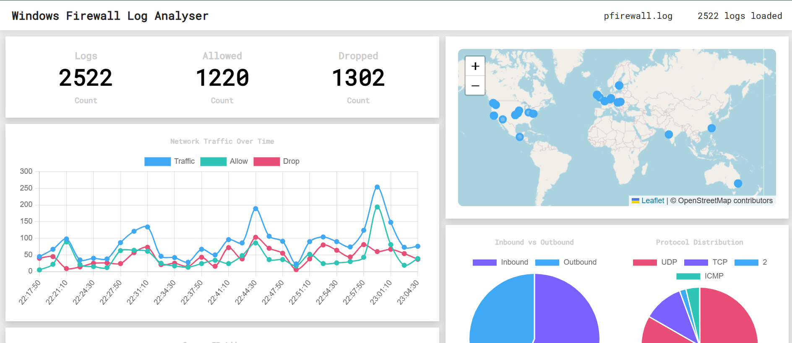
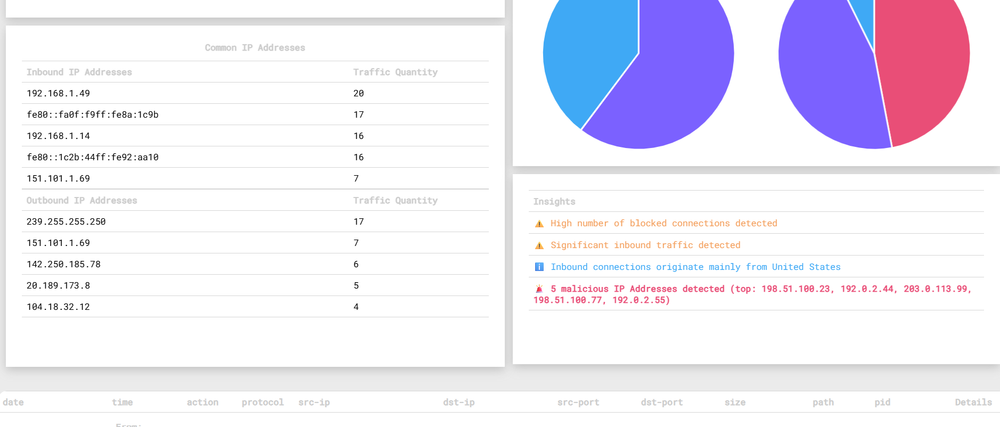
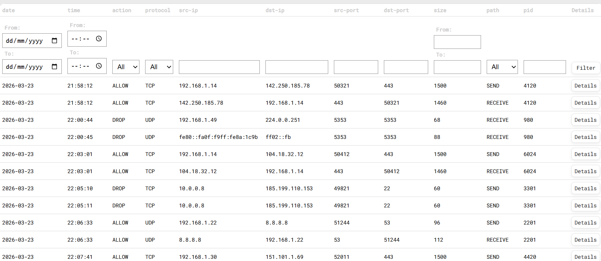
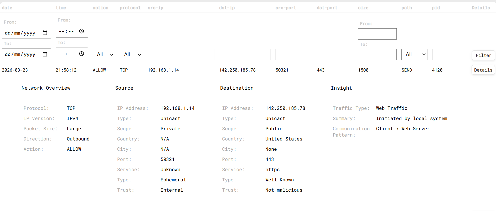

# Windows Firewall Log Analyser

A Flask-based web application that allows users to upload a raw windows firewall log file and produces a dashboard with traffic statistics, IP address geolocation mapping, IP reputation checks, and filterable log tables.

---

## Demo

---

## Overview

This application allows users to upload a raw windows firewall log and generate a useful log analysis page, analysis tools include:

- Summary Statistics.
- Traffic timeline line chart.
- Common inbound/outbound IP Addresses table.
- A world map of IP address locations.
- Informative pie charts.
- Insights table with informational, warning and alert notifications.
- filterable log table - above features correspond to filtered data.

---

## Motivation

Firewall logs are usually large and difficult to interpret manually. The purpose of this project is to simplify log analysis by transforming raw data into clear visual insights. This tool helps users to easily search through logs and identify suspicious activity.

---

## Features

- Summary statistics: Basic counts for total logs, allowed logs and dropped logs.
- Traffic timeline: line chart showing traffic volume over time, broken down by ALLOW and DROP.
- Geolocation map: plots source/destination IPs on a world map using the MaxMind GeoLite2 database.
- Protocol & direction charts: pie charts for the logs protocol breakdown and traffic direction.
- IP reputation checking: cross-references IPs against the Firehol Level 1 blocklist to flag malicious addresses.
- Insights: Automatically generates insights for high drop rates, significant inbound traffic, and malicious IP detections.
- Filterable log table: filter by date/time, IP, port, protocol, action, etc.
- Expandable log rows: click details button on any row for enriched detail including IP scope, geolocation, port service, traffic type, and communication pattern.
- Pagination: handles large log files with 100-row pages for better web page responsiveness.

---

## Tech Stack

- Backend: Python 3, Flask, Flask-WTF
- Frontend: HTML, CSS, JavaScript
- Mapping: Leaflet.js + OpenStreetMap
- Charts: Chart.js 
- Geolocation: MaxMind GeoLite2 (geoip2)
- IP Reputation: Firehol Level 1 blocklist
- Fonts: Roboto Mono (Google Fonts)

---

## Project Structure

Windows Firewall Log Analyser \
├── app.py                  # Flask application for routing and request handling \
├── logic.py                # All helper function for data processing + calculations \
├── templates/ \
│   ├── upload.html         # File upload page \
│   └── viewer.html         # Dashboard and log table viewer \
├── static/ \
│   └── styles.css          # Styling \
├── Geo/ \
│   └── GeoLite2-City.mmdb  # MaxMind database (not included — look at setup) \
├── Firehol/ \
│   └── firehol_level1.netset  # IP blocklist (not included — look at setup) \
├── requirements.txt \
└── README.md \

---

## Installation and Setup

### 1. Clone the repository

git clone 
cd Windows_Firewall_Log_Analyser

### 2. Install dependencies

pip install flask flask-wtf geoip2

### 3. Obtain the GeoLite2 database

This project uses the free MaxMind GeoLite2 City database for IP geolocation.

Create a free account at maxmind.com
Download the GeoLite2-City.mmdb binary database
Place it at Geo/GeoLite2-City.mmdb

### 4. Obtain the Firehol blocklist

Download firehol_level1.netset from iplists.firehol.org
Place it at Firehol/firehol_level1.netset

### 5. Set environment variables

export SECRET_KEY=your_secret_key \
export FLASK_DEBUG=1

### 6. Run the application

python app.py

Then open:
http://127.0.0.1:5000/

---

## How It Works

A user is first presented with an upload page. They can submit a file from their device and then click submit to post the file to the backend for processing. If an error occurs with the file upload, the user will receive a tailored error message that points them to the general location in their log file which is causing issues.

Once the file is uploaded, it goes through the following processing pipeline:

- Data Structure Creation: Parses the raw log file and creates a list of logs, each log a dict.
- Enriching: Add extra detail derived from base data (IP scope, geolocation, trust, etc).
- Configuring: Restructure the log file to control how fields are presented in web page.
- Filtering: Dynamically filters logs according to parameters set by the user.
- Pagination: Split logs into pages to help with web page rendering.
- Statistics generating: Calculate metrics for data visualisation on dashboard.
- Rendering: Display the results using flask templates.

---

## Future Improvements

- More detailed insight generation.
- Real-time firewall analysis.
- User customisable log tables (users can decide what fields appear in log table).

---

## Author

Ronan O'Keeffe

